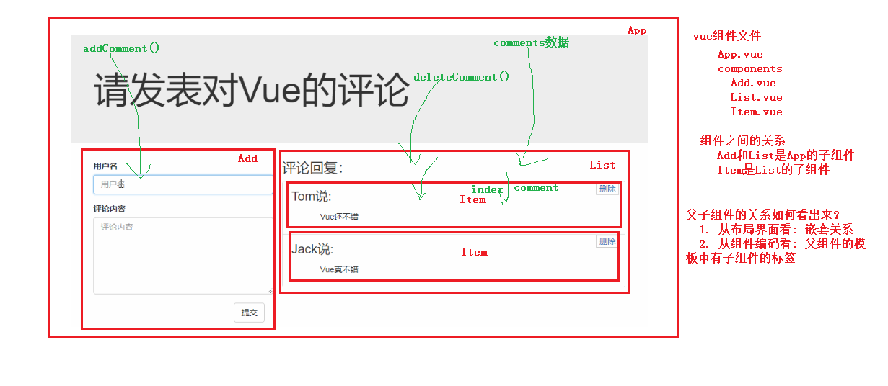

## 组件化编程的基本流程
	1). 拆分组件: 拆分界面, 定义/抽取组件
	2). 实现静态组件界面: 通过组件化(多组件)编码实现静态界面
	3). 实现动态组件界面:
		1). 初始化数据动态显示
		2). 交互(与用户)功能
			a. 添加
			b. 删除

## 设计组件的初始化数据的3个问题?
	1). 数据类型: [{username: 'xxx', content: 'good'}]
	2). 数据名称: comments
	3). 保存在哪个组件: 看数据是哪个组件需要(交给它), 还是哪些数组需要(交给共同父组件) App

## 父组件如何向子组件传递数据?
	1). 通过标签属性
	2). 父组件中给子组件标签指定属性: App中 <List :comments="comments"/>
	3). 子组件中声明接收标签属性: 接收的所有标签属性都会成为子组件对象的属性, 在模板中可以直接使用
	4). 子组件声明接收属性的方式
		方式一: 
			props: ['comments'], // 指定接收属性的属性名
		方式二:
			props: {
		      comments: Array  // 指定接收属性的属性名和属性值类型
		    }

## 组件标签名与属性名的大小问题
	基本规则: 写标签名或属性名时, 要么与定义的一样, 要么转小写中间用-连接
	1). 注册组件名与标签名: 
        注册名称        使用标签名
		add        ===> <add>    
		Add        ===> <Add> / <add>
		CommentAdd ===> <CommentAdd> / <comment-add>
		commentAdd ===> <commentAdd> / <comment-add>
		add-comment ===> <add-commend>
		原理: 如果完全一样直接匹配了, 否则将注册名称转换为小写中间用-连接与使用的标签比较如果完全相同才匹配
		add   ===> <Add>
		commentAdd  ===> <CommentAdd>

	2). 注册属性名与标签属性名: 同理
		声明接收属性	     传递标签属性
		comments    ===>  comments
		Comments    ===>  Comments / comments    但会有警告建议声明名称写小写
		myComments  ===>  myComments / my-comments
		MyComments  ===>  MyComments / my-comments
		原理: 如果完全一样直接匹配了, 否则将声明的属性名转换为小写中间用-连接与使用的标签属性名比较如果完全相同才匹配
	注意: 我建议大家写一样的, 但需要得看懂转小写的形式

## 更新数据的函数方法定义在哪?   
	数据在哪个组件, 那更新数据的行为(函数/方法)就定义
